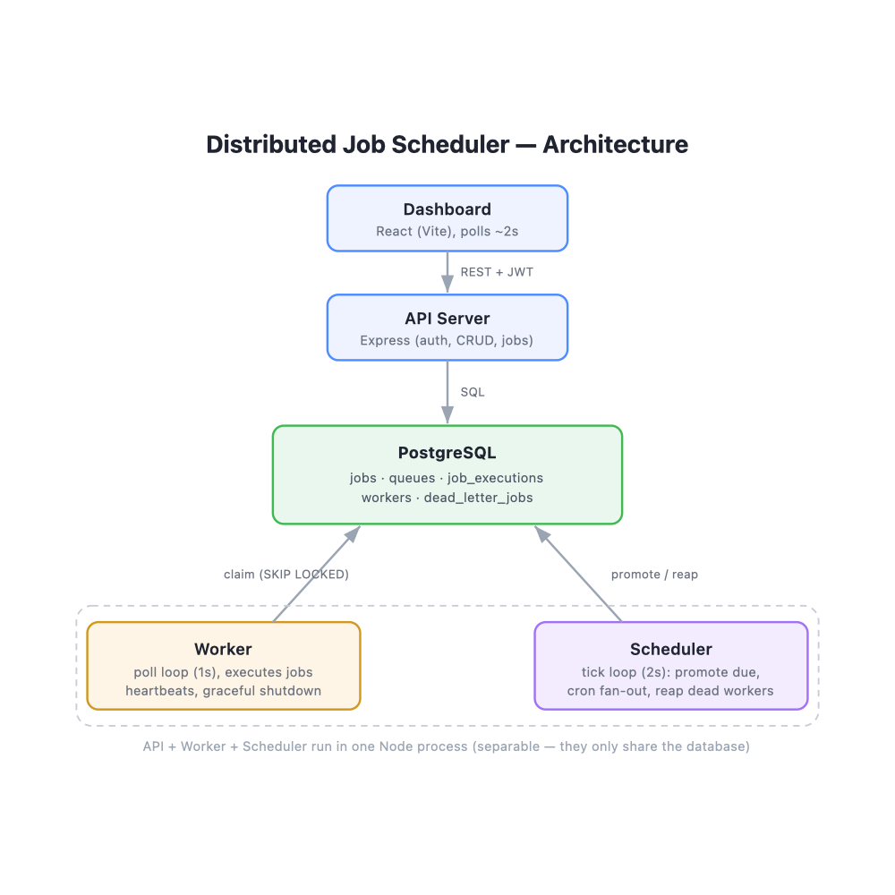

# Architecture



## Components

```
                    ┌──────────────┐
                    │   Dashboard  │  React (Vite)
                    └──────┬───────┘
                     REST + JWT │  │ WebSocket (push + polling fallback)
                    ┌──────▼────▼──┐
                    │   API server │  Express + ws
                    └──────┬───────┘
                           │ SQL
                    ┌──────▼───────────────────────────┐
                    │           PostgreSQL              │
                    │  jobs, queues, executions, DLQ,   │
                    │  project_members …                │
                    └──▲────────────▲──────────────▲────┘
                       │            │              │
          claim (SKIP LOCKED)  promote / reap   advisory lock
                       │            │              │
                ┌──────┴─────┐ ┌────┴───────┐ (leader election
                │   Worker   │ │  Scheduler │  — see below)
                │ poll loop  │ │ tick loop  │
                └────────────┘ └────────────┘
```

By default the API, worker, and scheduler run in a **single Node process**
(`server/src/index.ts`), keeping local setup to one command. The code stays cleanly separated
(`app.ts` builds the routes; `worker.ts`/`scheduler.ts` are independent and talk only to
Postgres), so the worker **is** splittable into its own process: set `RUN_EMBEDDED_WORKER=false`
on the API and run one or more `npm run worker` (`worker-main.ts`) processes to scale the job
tier separately. However many workers run, each claims jobs independently via `SKIP LOCKED`,
and only **one** scheduler ticks — decided by a Postgres advisory lock (`leader.ts`); see
[design-decisions.md](design-decisions.md#distributed-locking-postgres-advisory-lock-for-scheduler-leader-election).

## Data flow

1. A client submits a job via `POST /jobs`. Depending on type it lands as `queued`
   (immediate/batch) or `scheduled` (delayed/scheduled/recurring, with a future `run_at`).
2. The **scheduler** (`scheduler.ts`, every 2s) promotes due `scheduled` jobs to `queued`,
   fans out recurring jobs into runnable children and advances their next cron time, and
   requeues jobs orphaned by dead workers.
3. The **worker** (`worker.ts`) looks at each non-paused queue and atomically claims up to
   its free slots (`concurrency_limit − in-flight`) under a per-queue advisory lock, so the
   limit is a hard bound. It's **event-driven** — a `pg_notify('jobs_ready', …)` on enqueue
   wakes it immediately — with a 1s poll as the fallback floor.
4. Each claimed job goes `claimed → running → completed | failed`. On failure it either
   retries (re-`queued` with a backoff `run_at`) or, once attempts are exhausted, moves to
   the dead-letter queue. A job with `depends_on_job_id` set stays `queued` — never
   claimed — until that dependency reaches `completed`.
5. The worker writes a `job_executions` row per attempt, so the dashboard can show full
   retry history.
6. On every meaningful change (claim, completion, failure, queue pause/resume, job
   submission, member invite) the server pushes a `{"type": category}` message over
   WebSocket to connected dashboards, which re-fetch the relevant REST endpoint — the
   dashboard's own polling stays on as a fallback in case the socket is unavailable.

## Reliability

- **Atomic claiming** — the claim is a single `UPDATE … WHERE id IN (SELECT … FOR UPDATE
  SKIP LOCKED)`. Two workers hitting the same queue never get the same row; `SKIP LOCKED`
  means they step over each other's locked rows instead of blocking.
- **Heartbeats + reaper** — workers update `last_heartbeat_at` every 5s. If a worker dies
  mid-job, the scheduler's reaper (30s threshold) requeues its in-flight jobs, giving
  at-least-once execution.
- **Graceful shutdown** — on SIGINT/SIGTERM the worker stops claiming, waits for in-flight
  jobs to finish (up to 10s), and releases any leftovers back to `queued`.
