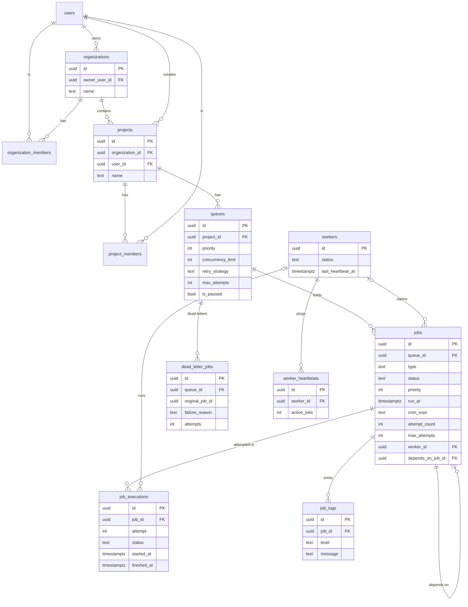

# Database Schema

The diagram below is the authoritative, always-current schema (rendered from source by any
Mermaid viewer, including GitHub). The PNG in `diagrams/er-diagram.png` is an earlier
simplified overview of the core scheduling tables.



```
users ──< organization_members >── organizations
                                        └─< projects ──< project_members >── users
                                              └─< queues
                                                    └─< jobs ─────< job_executions
                                                    └─< jobs ─────< job_logs
                                                    └─< jobs (self-ref: depends_on_job_id)
                                                    └─< dead_letter_jobs

workers ──< worker_heartbeats
workers ──< (jobs.worker_id, job_executions.worker_id)
```

`──<` means one-to-many. The full DDL lives in the versioned migrations under
[`server/src/migrations/`](../server/src/migrations/) (applied in order, tracked in
`schema_migrations`).

## Tables

| Table | Purpose | Key columns |
|---|---|---|
| `users` | accounts | `email` (unique), `password_hash` |
| `organizations` | top-level tenant; projects live under one | `name`, `owner_user_id` → users |
| `organization_members` | who belongs to an org, and how | `organization_id`, `user_id`, `role` (`owner`\|`member`) |
| `projects` | created by a user, owned by an org | `organization_id` → organizations, `user_id` (creator) |
| `project_members` | who can access a project, and how | `project_id`, `user_id`, `role` (`admin`\|`viewer`) |
| `queues` | config lives here | `project_id`, `priority`, `concurrency_limit`, `retry_strategy`, `retry_base_delay_ms`, `max_attempts`, `is_paused` |
| `jobs` | one row per job | `queue_id`, `type`, `status`, `priority`, `run_at`, `cron_expr`, `attempt_count`, `max_attempts`, `worker_id`, `depends_on_job_id` |
| `job_executions` | one row per attempt (metrics) | `job_id`, `worker_id`, `attempt`, `status`, `started_at`, `finished_at`, `error` |
| `job_logs` | human-readable log lines per job | `job_id`, `execution_id`, `attempt`, `level` (`info`\|`warn`\|`error`), `message` |
| `workers` | registered workers | `last_heartbeat_at`, `status` |
| `worker_heartbeats` | append-only heartbeat history (1h retention) | `worker_id`, `active_jobs`, `created_at` |
| `dead_letter_jobs` | permanently failed jobs | `original_job_id`, `failure_reason`, `attempts` |

**`project_members`** is why access checks throughout the API join through it rather than
comparing `projects.user_id` directly — a project's creator is just the first admin member,
not privileged in the schema beyond that. See
[design-decisions.md](design-decisions.md#role-based-access-control-project-membership-not-a-global-user-flag).

**`jobs.depends_on_job_id`** is a nullable self-reference (`ON DELETE SET NULL`, so deleting
a dependency doesn't orphan the row, just unblocks it). Indexed
(`idx_jobs_depends_on`) since the claim query joins on it every poll cycle.

## Design notes

**Keys.** UUID primary keys (`gen_random_uuid()`) everywhere. UUIDs avoid exposing row
counts and sidestep sequence coordination — useful since workers generate their own IDs.

**Tenancy.** `organizations` is the top of the hierarchy: `organizations → projects →
queues → jobs`. Every user gets a personal org at registration (a transaction creates
user + org + `owner` membership together), so a project always has an org to belong to.
Access is checked at two levels — org membership (`owner`\|`member`) and project membership
(`admin`\|`viewer`).

**Foreign keys & cascades.** `projects → organizations`, `projects → users`,
`queues → projects`, and `jobs/dead_letter_jobs → queues` use `ON DELETE CASCADE`:
deleting an org cleanly removes its projects, queues, and jobs. `job_logs → jobs` and
`worker_heartbeats → workers` also cascade. `jobs.worker_id`, `job_executions.worker_id`,
and `job_logs.execution_id` use `ON DELETE SET NULL` so removing a worker or execution
record never destroys the surrounding job history.

**Indexes.** The hot path is the claim query — filter by `queue_id` + `status`, order by
`priority DESC, run_at`. That's served by:

```sql
create index idx_jobs_claim on jobs (queue_id, status, priority desc, run_at);
```

`idx_jobs_due (status, run_at)` supports the scheduler's "promote due jobs" sweep,
`idx_executions_job (job_id)` keeps the per-job history lookup fast, and
`idx_jobs_depends_on (depends_on_job_id)` (partial, `where depends_on_job_id is not null`)
keeps the dependency join in the claim query cheap.

**Status as CHECK constraints** rather than Postgres enums — the valid values are enforced
at the DB (`queued|scheduled|claimed|running|completed|failed|dead_letter`) but stay easy
to extend without an `ALTER TYPE` migration.

**Normalization.** Retry configuration (the *retry policy*) lives once on the queue, not
copied onto every job — a deliberate choice over a separate `retry_policies` table, since a
policy has no identity beyond the queue it configures. A job stores only `max_attempts`
(snapshotted at creation, so changing the queue later doesn't retroactively alter in-flight
jobs) and its own `attempt_count`.

**Executions vs. logs.** `job_executions` is the structured *metrics* record — one row per
attempt with `started_at`/`finished_at` (duration) and terminal status. `job_logs` is the
*narrative* — many human-readable lines per attempt (started, completed, failed, retry
scheduled, dead-lettered), each tagged `info`/`warn`/`error`. Kept separate so metrics stay
queryable without parsing log text.

**Worker heartbeats.** `workers.last_heartbeat_at` holds the latest ping for the liveness
check (the reaper compares it against a 30s timeout). `worker_heartbeats` is the append-only
*history* — each worker inserts a row every 5s and prunes its own rows older than an hour, so
the table stays bounded while still showing recent activity (`heartbeats_15m`).

**Scheduled jobs** are modeled as `jobs` rows with `type in (delayed, scheduled, recurring)`
and `status = 'scheduled'`, carrying `run_at`/`cron_expr`; the scheduler promotes them to
`queued` when due (see [architecture.md](architecture.md)). No separate table is needed — a
scheduled job *is* a job, just not yet runnable.
